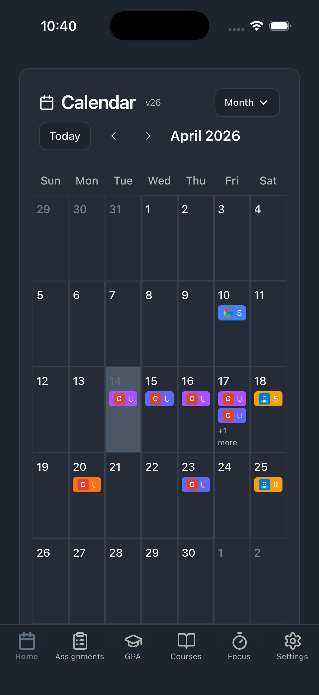
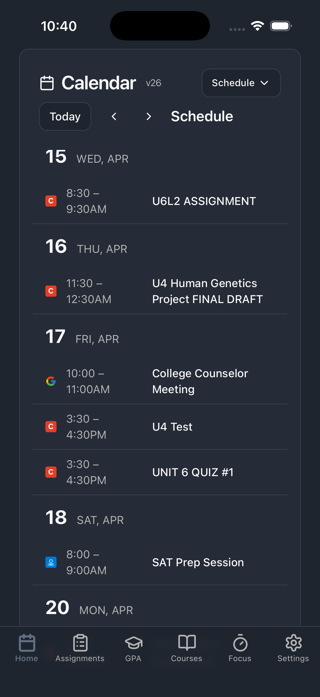
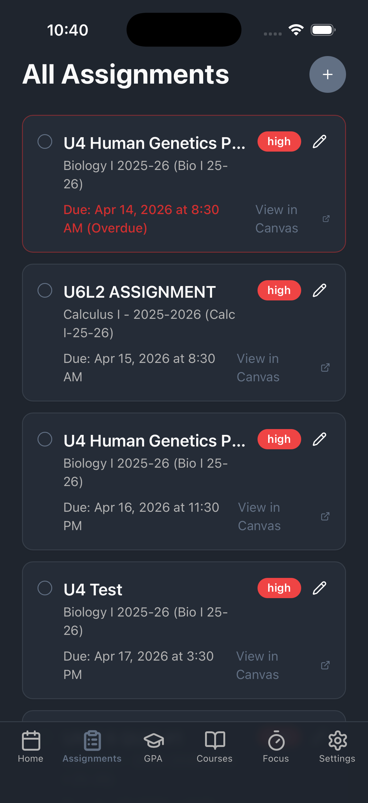
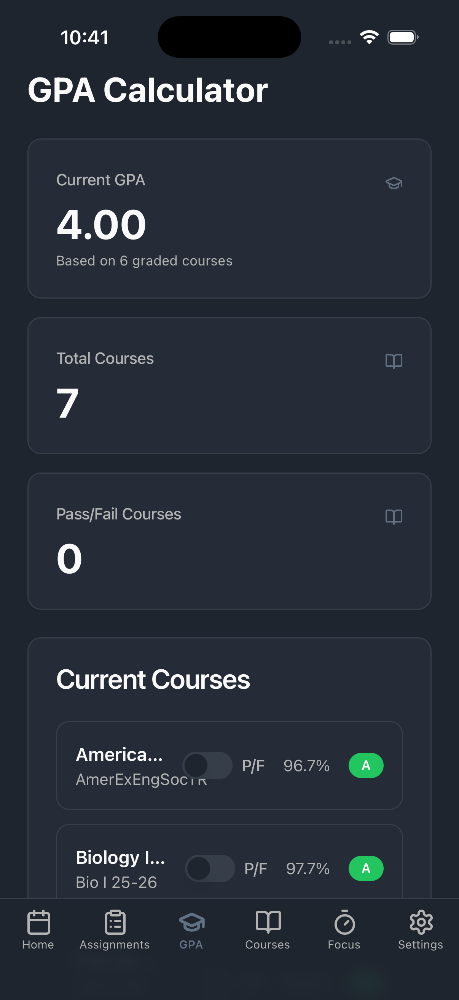
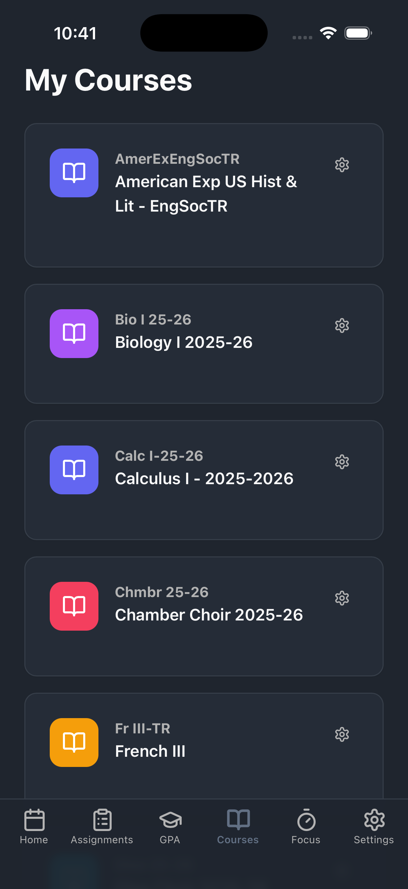
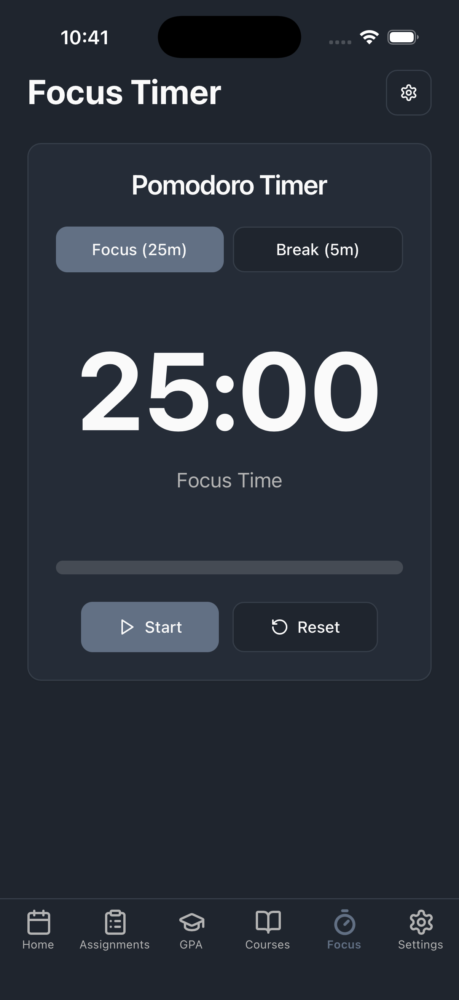
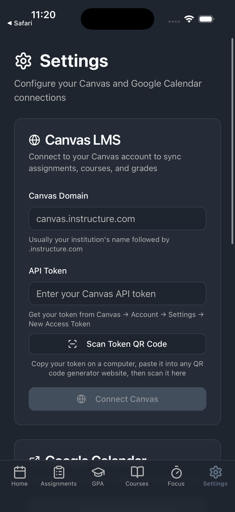
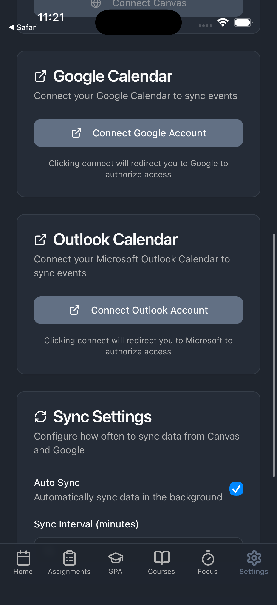

# Co-Captain 🎓

**Your academic life, unified.**

Co-Captain is a cross-platform student productivity app that automatically syncs **Google Calendar**, **Outlook Calendar**, and **Canvas LMS** into one clean, unified view. No more tab-switching between platforms — see your assignments, deadlines, grades, and personal events all in one place.

Available as a **web app**, **iOS app**, and **Android app** — all from a single codebase.

---

## Why We Built This

Students today juggle assignments from Canvas, events from Google Calendar, and reminders from a dozen other places. We built Co-Captain because we lived that frustration ourselves — constantly missing due dates buried in Canvas, or forgetting personal commitments because they lived in a separate app. Co-Captain brings everything together so you can focus on what matters: your work.

---

## Features

### 📅 Unified Calendar
See Google Calendar, Outlook Calendar, and Canvas assignments side by side in a single calendar. Switch between **month**, **week**, **day**, and **schedule** views. Pull down to refresh on mobile.

### 📋 Assignments
All Canvas assignments listed with due dates and completion status. Add your own custom assignments with the **+** button — no Canvas account required. Edit, prioritize, and check off tasks.

### 🎓 GPA Calculator
Your current grades pulled directly from Canvas, with automatic GPA calculation on a 4.0 scale. Supports observer (parent) accounts. Mark courses as Pass/Fail to exclude from GPA.

### 📚 Courses
A full list of your enrolled Canvas courses. Customize each course's color, toggle calendar/assignment visibility, and open courses directly in Canvas.

### ⏱️ Focus Timer
Built-in Pomodoro timer — 25 minutes of focused work, then a 5-minute break. Customizable durations. Stay in the zone without needing a separate timer app.

### ⚙️ Settings
Connect Canvas (domain + API token), Google Calendar (OAuth 2.0), and Outlook Calendar (OAuth 2.0). Configure auto-sync interval, switch between dark and light themes.

---

## Pages

### Calendar — Home

Your unified command center. The Calendar page merges events from **Google Calendar**, **Outlook Calendar**, and **Canvas LMS** into a single view — assignments, personal events, and course deadlines all in one place.

**How to use:**
- Switch between **Month**, **Week**, **Day**, and **Schedule** views using the dropdown at the top
- Tap any date in Month view to drill down into that day's events
- Navigate forward and back with the **<** and **>** arrows
- Each event is color-coded by course or calendar source — tap to see details or open in Canvas/Google/Outlook
- Check off completed assignments directly from the calendar
- **Pull down to refresh** (iOS/Android) to sync all calendar sources instantly

  

---

### Assignments

A focused list of everything you need to do. Canvas assignments are synced automatically, and you can add your own custom tasks for non-Canvas work.

**How to use:**
- Assignments are sorted by due date — overdue items appear at the top with a red indicator
- Check the box next to an assignment to mark it as complete
- Tap the **+** button to create a custom assignment with a title, description, due date, and priority level
- Tap the pencil icon on any custom assignment to edit it
- Each assignment shows its course name, due date, and priority badge (High / Medium / Low)
- Tap the link icon to open the assignment directly in Canvas



---

### GPA Calculator

See your current grades at a glance, pulled directly from Canvas. Co-Captain calculates your GPA automatically based on the standard 4.0 scale.

**How to use:**
- Your overall GPA is displayed at the top, calculated from all graded courses
- Each course shows its current letter grade and percentage score
- Toggle the **P/F** switch next to any course to mark it as Pass/Fail — it will be excluded from the GPA calculation
- Grades update automatically when Canvas syncs



---

### Courses

A complete list of your enrolled Canvas courses with per-course settings to customize how they appear throughout the app.

**How to use:**
- Each course card shows the course name, code, and a color-coded icon
- Tap a course to open it directly in Canvas
- Tap the **gear icon** on any course to access its settings:
  - **Course Color** — pick a color that will be used for this course's events on the calendar
  - **Show on calendar** — toggle whether this course's assignments appear on the Calendar page
  - **Show assignments** — toggle whether this course's assignments appear on the Assignments page
  - **Treat as event** — toggle to display this course's assignments as calendar events instead of tasks



---

### Focus Timer

A built-in Pomodoro timer to help you stay productive. Work in focused intervals, then take short breaks — no extra app needed.

**How to use:**
- Tap **Start** to begin a 25-minute focus session
- The circular progress ring and countdown show your remaining time
- When the timer ends, it automatically switches to a 5-minute break (and vice versa)
- Tap **Pause** to pause the timer, **Reset** to start over
- Tap the **gear icon** to customize the focus duration (default 25 min) and break duration (default 5 min)



---

### Settings

Connect and manage your calendar and LMS accounts. All connections are optional — use only the ones you need.

**How to use:**
- **Canvas LMS** — Enter your institution's Canvas domain and API token, then tap **Connect Canvas**. Use **Scan Token QR Code** on mobile to scan a token from your computer. Tap **Test** to verify the connection. Tap **Disconnect** to remove credentials.
- **Google Calendar** — Tap **Connect Google Account** to sign in via OAuth. No API keys needed — just authorize access. Tap **Test** to verify, **Disconnect** to remove.
- **Outlook Calendar** — Tap **Connect Outlook Account** to sign in with your Microsoft account via OAuth. Same connect/disconnect/test flow as Google.
- **Sync Settings** — Toggle **Auto Sync** on/off, and set the sync interval (1–60 minutes).
- **Appearance** — Switch between **Dark** and **Light** themes. Your choice is saved and persists across sessions.

  
---

## Tech Stack

| Layer                | Technology                                       |
| -------------------- | ------------------------------------------------ |
| **Frontend**         | React 18, TypeScript, Tailwind CSS, shadcn/ui    |
| **Build Tool**       | Vite                                             |
| **Mobile**           | Capacitor 8 (iOS + Android from single codebase) |
| **Backend**          | Supabase (auth, PostgreSQL, edge functions)      |
| **APIs**             | Google Calendar API, Microsoft Graph API, Canvas LMS REST API |
| **State Management** | TanStack React Query v5                          |

---

## Getting Started

### Option 1: Web App
Visit the hosted app and connect your accounts in Settings.

### Option 2: Run from Source

**Requirements:** Node.js 18+, npm

```bash
git clone https://github.com/LakeMont198/co-captain.git
cd co-captain
npm install
npm run dev
```

Then open [http://localhost:8080](http://localhost:8080) in your browser.

---

## Connecting Your Accounts

### Canvas LMS
1. Go to **Settings → Canvas**
2. Enter your institution's Canvas domain (e.g. `canvas.instructure.com`)
3. Generate an API token: Canvas → Account → Settings → Approved Integrations → **+ New Access Token**
4. Paste the token and tap **Connect Canvas**

> Note: Canvas is optional — the calendar, focus timer, and custom assignments work without it.

### Google Calendar
1. Go to **Settings → Google Calendar**
2. Tap **Connect Google Account**
3. Sign in with your Google account and authorize access
4. Events appear on the calendar automatically

### Outlook Calendar
1. Go to **Settings → Outlook Calendar**
2. Tap **Connect Outlook Account**
3. Sign in with your Microsoft account and authorize access
4. Events appear on the calendar automatically

> Both Google and Outlook use OAuth 2.0 — Co-Captain never sees your password.

---

## Privacy & Security

- Canvas API tokens are **masked** after entry and stored using platform-native keychains (Keychain on iOS, Keystore on Android)
- Google Calendar and Outlook Calendar use **OAuth 2.0** — Co-Captain never sees your passwords
- Only **read access** is requested — Co-Captain never modifies your grades, assignments, or calendar events
- Background sync **pauses automatically** when the app is in the background to minimize battery and data usage
- Dark and light themes available — your preference is saved locally

---

## Project Structure

```
src/
├── components/       # Reusable UI (Sidebar, MobileTabBar, AuthForm, shadcn/ui)
├── hooks/            # Custom React hooks (pull-to-refresh, theme, Canvas, calendar)
├── integrations/
│   ├── canvasApi.ts          # Canvas LMS REST API client (native + web proxy)
│   ├── googleCalendar.ts     # Google Calendar OAuth + event fetching
│   ├── outlookCalendar.ts    # Outlook Calendar OAuth PKCE + Microsoft Graph API
│   ├── secureStorage.ts      # Keychain/Keystore abstraction
│   └── supabase/
│       └── client.ts         # Supabase client
├── pages/            # Calendar, Assignments, GPA, Courses, Focus, Settings
└── App.tsx           # Routing, auth, deep link handling, and sync logic
```

---

## License

MIT
